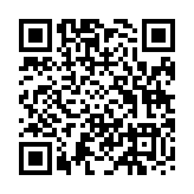
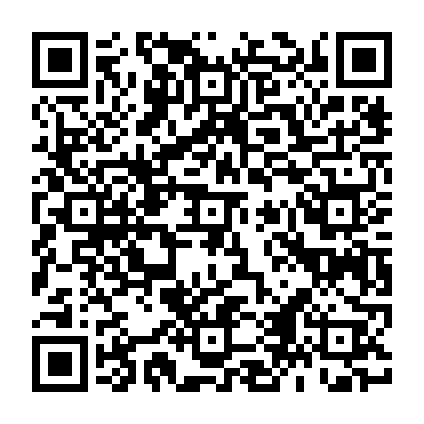
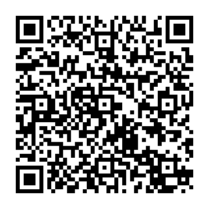
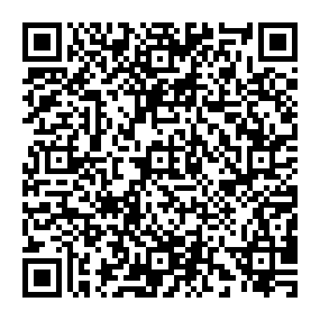

<div align="center">
  

  # Flow Desktop

  **A privacy-respecting YouTube and YouTube Music client with a native, fully local recommendation engine.**

  Flow Desktop is the desktop companion to [Flow for Android](https://github.com/A-EDev/Flow), built with Rust, Tauri, React, and TypeScript.

  [Downloads](https://github.com/A-EDev/flow-desktop/releases) · [Android app](https://github.com/A-EDev/Flow) · [Community](https://www.reddit.com/r/Flow_Official/) · [Support development](#support--donations)
</div>

> Flow Desktop is under active development. Features and storage formats may change before the first stable release.

## Why Flow?

Most alternative YouTube clients trade away recommendations to avoid tracking. Flow keeps discovery without outsourcing your viewing profile: FlowNeuro learns from your activity locally, ranks content on your device, and gives you direct control over its memory.

## Features

- Native video playback with quality and codec selection, SABR/DASH/HLS support, chapters, subtitles, playback speed, queues, mini-player, and Picture-in-Picture.
- YouTube Music home, search, artists, albums, playlists, queue management, synchronized lyrics, repeat, shuffle, and equalizer controls.
- A dedicated Shorts feed with comments, descriptions, saved Shorts, looping, auto-next, and timed scrolling modes.
- Local subscriptions, playlists, Watch Later, likes, albums, video/music history, Continue Watching, and regional Explore feeds.
- Channel pages with videos, Shorts, playlists, community posts, comments, and live chat support.
- SponsorBlock, DeArrow, and Return YouTube Dislike integrations.
- Imports from Flow backups, Google Takeout, NewPipe, LibreTube, FreeTube, and OPML.

### FlowNeuro

FlowNeuro is Flow's native local recommendation engine. It learns from watches, skips, likes, dislikes, searches, topic preferences, and creator affinity without sending a recommendation profile to a Flow server.

The Control Center lets you inspect topic weights, time-based patterns, channel memory, learning activity, and blocked content. You can export, import, reset, or temporarily pause learning with Deep Flow mode.

## Privacy and security

- No Google account is required, and Flow contains no advertising or analytics SDK.
- History, settings, library data, and recommendation state are stored locally in SQLite.
- Tauri permissions are restricted to the main window and the OS, dialog, and external-link capabilities the app uses.
- A strict Content Security Policy blocks arbitrary scripts, frames, objects, and remote application code.
- Rust validates search terms, video IDs, channel IDs, browse IDs, and continuation tokens before network requests.
- Media is relayed through a tokenized loopback-only proxy instead of exposing a public local server.
- BotGuard/PO-token handling runs through a native hidden WebView, with a packaged Node script retained only as a compatibility fallback.

Flow still contacts YouTube and optional services such as SponsorBlock, DeArrow, Return YouTube Dislike, and configured lyrics providers when their features are used.

## Downloads and supported systems

Release builds are published through [GitHub Releases](https://github.com/A-EDev/flow-desktop/releases).

| Platform | Supported versions | Architectures | Packages |
| --- | --- | --- | --- |
| Windows | Windows 10 22H2, Windows 11 | x64, ARM64 | NSIS installer |
| macOS | macOS 13 Ventura or later | Intel x64, Apple Silicon | DMG |
| Linux | Ubuntu 22.04+, Debian 12+, and comparable modern distributions | x64, ARM64 | AppImage, `.deb`, `.rpm` |

Linux builds require a compatible glibc, GTK 3, and WebKitGTK 4.1 environment. Legacy 32-bit systems are not supported.

## Development

Requirements: Node.js 22.12+, pnpm 11.9+, stable Rust, and the [Tauri 2 prerequisites](https://v2.tauri.app/start/prerequisites/) for your operating system.

```sh
pnpm install --frozen-lockfile
pnpm tauri dev
```

Build packages for the current operating system:

```sh
pnpm test
pnpm build
pnpm tauri build
```

Windows, Linux, and macOS packages are built natively by the GitHub Actions release workflow. Production macOS and Windows releases should be signed and, on macOS, notarized before publication.

<a id="support--donations"></a>
## Support & donations

Flow is free and open-source software maintained by an independent developer. Patreon supports card, PayPal, Apple Pay, recurring support, and one-time tips.

[](https://patreon.com/A_EDev)

You can also donate directly with crypto. Scan a QR code using a compatible wallet, or click it where custom wallet links are supported. The address and network are printed below every code—always verify both before sending.

<table>
  <tr>
    <td align="center">
      <strong>USDT · TRC20</strong><br><br>
      <a href="tron:TRz7VDrTWwCLCfQmYBEJakqcZgbFNWfUMP"></a><br><br>
      <code>TRz7VDrTWwCLCfQmYBEJakqcZgbFNWfUMP</code>
    </td>
    <td align="center">
      <strong>Bitcoin · BTC</strong><br><br>
      <a href="bitcoin:bc1qgmkkxxvzvsymtpfazqfl93jw6k4jgy0xmrtnv8?label=Flow%20Development"></a><br><br>
      <code>bc1qgmkkxxvzvsymtpfazqfl93jw6k4jgy0xmrtnv8</code>
    </td>
    <td align="center">
      <strong>Ethereum · ERC-20</strong><br><br>
      <a href="ethereum:0xfbac6f464fec7fe458e318971a42ba45b305b70e"></a><br><br>
      <code>0xfbac6f464fec7fe458e318971a42ba45b305b70e</code>
    </td>
  </tr>
  <tr>
    <td align="center" colspan="2">
      <strong>Solana · SOL</strong><br><br>
      <a href="solana:7b3SLgiVPb8qQUvERSPGRWoFoiGEDvkFuY98M1GEngug?label=Flow%20Development"></a><br><br>
      <code>7b3SLgiVPb8qQUvERSPGRWoFoiGEDvkFuY98M1GEngug</code>
    </td>
    <td align="center">
      <strong>Monero · XMR</strong><br><br>
      <a href="monero:8AgaxZnpEvT8VXJpczpL7BQejwSEw97saJmKYqq4zKErbe9bkYSwUhJ813msPPbdYhF11oz4N7tfEj4Zi6k27fKD83ca1if"></a><br><br>
      <code>8AgaxZnpEvT8VXJpczpL7BQejwSEw97saJmKYqq4zKErbe9bkYSwUhJ813msPPbdYhF11oz4N7tfEj4Zi6k27fKD83ca1if</code>
    </td>
  </tr>
</table>

Wallet URI support varies between wallet applications. Bitcoin, Ethereum, Solana, and Monero QR codes use their standard payment URI formats; the TRC20 code uses a Tron URI and may fall back to displaying the address in wallets that do not register the scheme.

## License

Flow Desktop is free software licensed under the [GNU General Public License v3.0](LICENSE).

Copyright © 2025–2026 A-EDev
